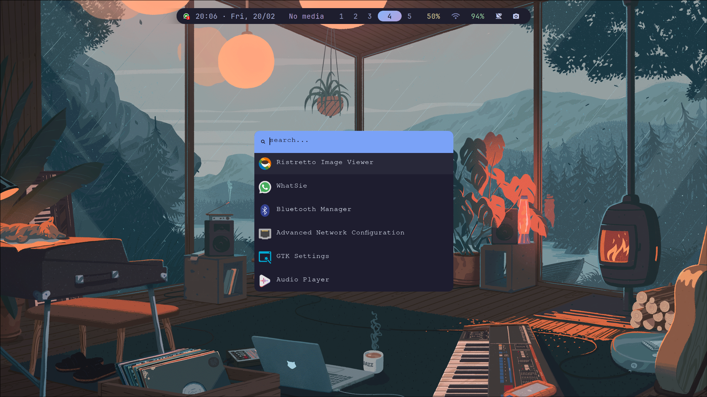
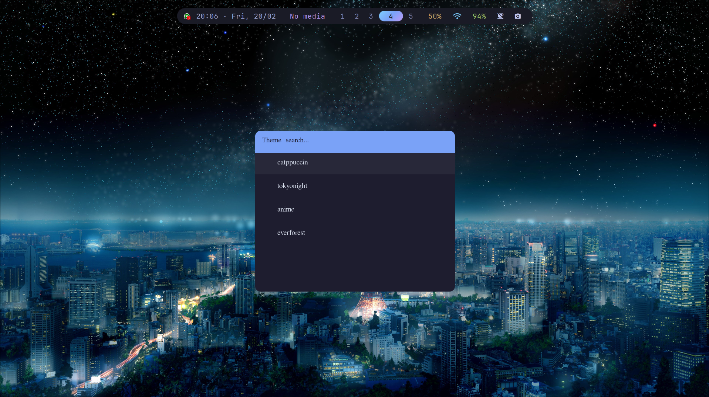
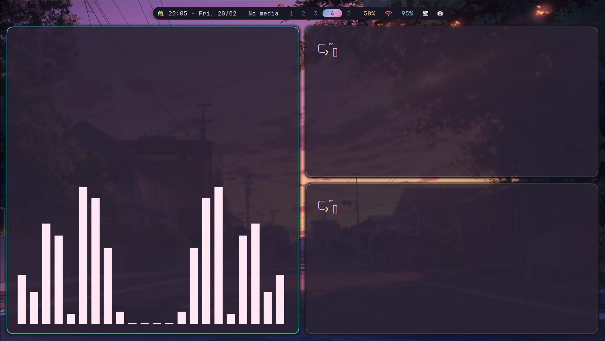

<!-- 🌊 Animated Banner -->
<p align="center">
  
</p>

<!-- ⚡ Typing Animation -->
<p align="center">
  
</p>

---

<p align="center">
  
  
  
  
</p>

---

# ⚡ END4DOTFILES

<p align="center">
<b>Hyprland • Waybar • Kitty • Rofi • SwayNC • Themed Workflow Engine</b>
</p>

---

# 🔥 Preview

<p align="center">
  
  
  
</p>

---

# 🧩 Why This Exists

After trying many beautiful Hyprland setups, one problem kept appearing:

They looked amazing.  
Then Arch updated.  
Then Hyprland crashed.

Hardcoded paths.  
Scattered configs.  
Random scripts.  
No backup system.

So this was built differently.

End4Dotfiles is structured so:

✔ Updates don’t destroy your environment  
✔ Themes are isolated  
✔ Scripts are readable  
✔ Everything is modular  
✔ Nothing is chaotic  

This is not just visual polish.  
It is controlled architecture.

---

# 🖥 Resolution Support

Optimized for:

## 1920×1080

But works smoothly on:

- 1366×768  
- 1600×900  
- 2560×1440  
- Ultrawide monitors (minor spacing tweaks)

No fragile pixel-perfect traps.

---

# 📦 Essential Packages

During installation, you can choose to automatically install the full Hyprland ecosystem.

The installer runs:

```bash
yay -S --needed \
hyprland \
waybar \
kitty \
rofi \
swaync \
wf-recorder \
grim \
slurp \
brightnessctl \
nwg-look \
network-manager-applet \
bluez \
blueman \
alsa-utils \
zsh

```
